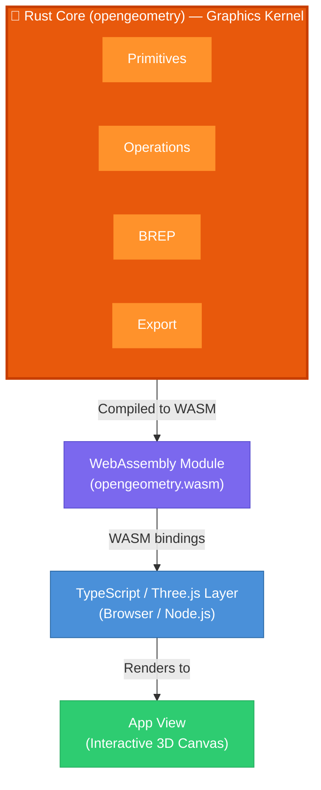

OpenGeometry is built with a layered architecture designed to bring high-performance CAD operations to the web. The system follows a clear separation between the computational core and the rendering layer.

## System Architecture

The architecture consists of three primary layers:



### Data Flow

1. **User Input** → TypeScript wrapper classes (Line, Cuboid, etc.)
2. **TypeScript** → WASM function calls via `wasm-bindgen`
3. **Rust Core** → Geometric computations, BREP construction
4. **WASM Output** → Serialized geometry data (JSON/typed arrays)
5. **TypeScript** → Three.js mesh rendering

## Module Structure

The Rust core is organized into focused modules as defined in `src/lib.rs`:

### Core Modules

**primitives**
- `arc` - Circular arc segments
- `cuboid` - Box primitives
- `curve` - Parametric curves
- `cylinder` - Cylindrical solids
- `line` - Line segments
- `polygon` - N-sided planar polygons
- `polyline` - Connected line segments
- `rectangle` - Rectangular faces
- `sphere` - Spherical solids
- `sweep` - Swept surfaces
- `wedge` - Wedge/prism solids

**operations**
- `extrude` - Extrude 2D profiles into 3D solids
- `offset` - Offset curves and faces
- `sweep` - Sweep profiles along paths
- `triangulate` - Convert faces to triangular meshes
- `windingsort` - Polygon winding order utilities

**booleans**
- Kernel-backed boolean operations (union, intersection, subtraction)

**brep**
Boundary representation data structures:
- `vertex` - Point in 3D space
- `halfedge` - Directed half-edge topology (twin/next/prev)
- `edge` - Undirected edge with primary/twin half-edge references
- `loop` - Face boundary loops (outer and inner holes)
- `face` - Face normal and loop references
- `wire` - Polyline topology (open or closed)
- `shell` - Face groups (open or closed)
- `builder` - Safe B-Rep construction helper that validates topology
- `error` - B-Rep error types used during building and validation

**scenegraph**
Scene management system for organizing multiple geometric entities.

**export**
- `stl` - STL export (bytes, experimental)
- `ifc` - IFC export (text, experimental)
- `pdf` - PDF export (native only, experimental)
- `step` - STEP export (text, experimental)
- `projection` - 2D projection with hidden line removal (experimental)

**geometry**
Base geometry utilities and triangle operations.

**utility**
Helper functions for geometric computations.

## Build Process

### Rust to WASM Compilation

The core is compiled to WebAssembly using `wasm-pack`:

```bash
cd main/opengeometry
wasm-pack build --target web
```

This generates:
- `opengeometry_bg.wasm` - The compiled WebAssembly binary
- `opengeometry.js` - JavaScript bindings
- `opengeometry.d.ts` - TypeScript type definitions

### TypeScript Wrapper Build

The Three.js integration layer is bundled using Rollup:

```bash
npm run build-three
```

This creates the user-facing API that wraps WASM calls with Three.js-compatible interfaces.

### Complete Build

```bash
npm run build
```

This runs:
1. `build-core` - Compiles Rust to WASM
2. `build-three` - Bundles TypeScript wrapper
3. `copy-wasm` - Copies artifacts to dist/

## Configuration

### Cargo.toml

The library is configured to build both as a WebAssembly module and a native Rust library:

```toml
[lib]
crate-type = ["cdylib", "rlib"]
```

- **cdylib** - C-compatible dynamic library for WASM
- **rlib** - Rust library for native compilation

### Key Dependencies

**WASM/Serialization:**
- `wasm-bindgen` - Rust/JavaScript interop
- `serde` - Serialization framework
- `serde-wasm-bindgen` - WASM-specific serialization

**Math:**
- `openmaths` - Vector and matrix operations

**Geometry:**
- `earcutr` - Polygon triangulation
- `uuid` - Unique identifiers for entities

**Export (native only):**
- `printpdf` - PDF generation (requires native compilation)

## Platform Targets

### Web (WASM)
Primary target using `target_arch = "wasm32"`:
- Runs in browser via WebAssembly
- Limited to WASM-compatible operations
- No file I/O, no native PDF export

### Native (CLI/Server)
Secondary target for server-side use:
- Full Rust performance
- File I/O capabilities
- PDF export via `printpdf`
- Configured with `cfg(not(target_arch = "wasm32"))`

## Performance Characteristics

- **Rust Core**: Near-native performance, memory-safe
- **WASM Overhead**: Minimal for compute-heavy operations
- **Serialization**: JSON for complex types, typed arrays for vertex data
- **Three.js Integration**: Efficient mesh creation from BREP output

## Next Steps

<CardGroup cols={2}>
  <Card title="Primitives and Shapes" icon="shapes" href="OpenGeometry/concepts/primitives-and-shapes">
    Explore the available 2D and 3D primitives you can create
  </Card>
  <Card title="CAD Operations" icon="dice-d8" href="OpenGeometry/concepts/operations">
      Learn about extrusion, offsetting, sweeping, and more
  </Card>
  <Card title="Boundary Representation" icon="cube" href="OpenGeometry/concepts/brep">
    Understand how BREP works and how to build complex geometry
  </Card>
  <Card title="Booleans" icon="object-union" href="OpenGeometry/concepts/booleans">
    See how to perform boolean operations with OpenGeometry
  </Card>
</CardGroup>